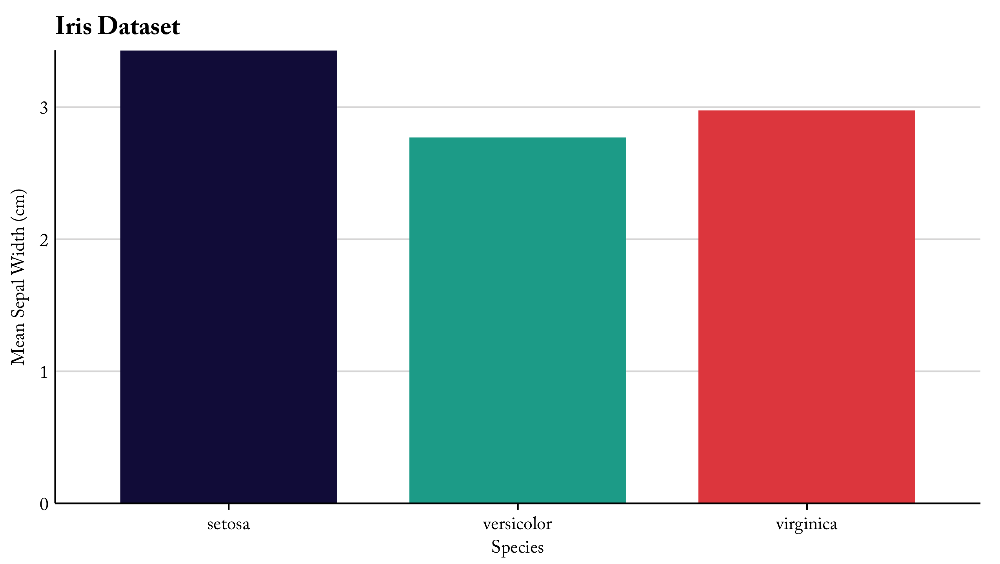
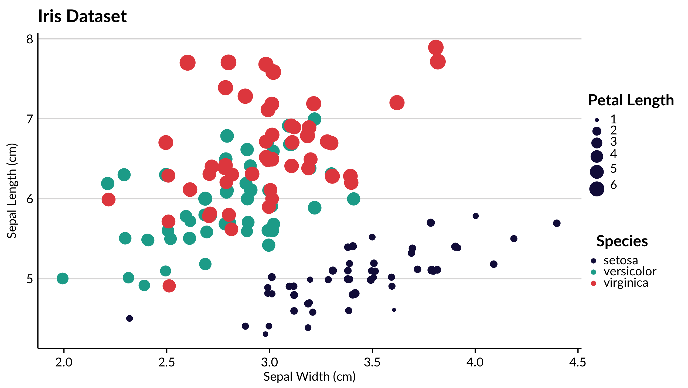
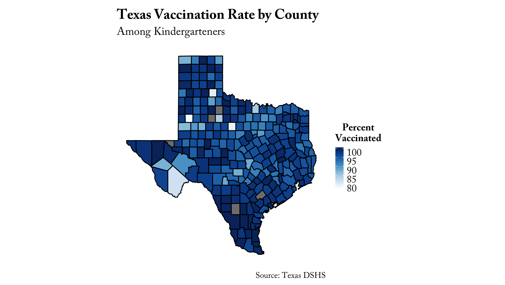
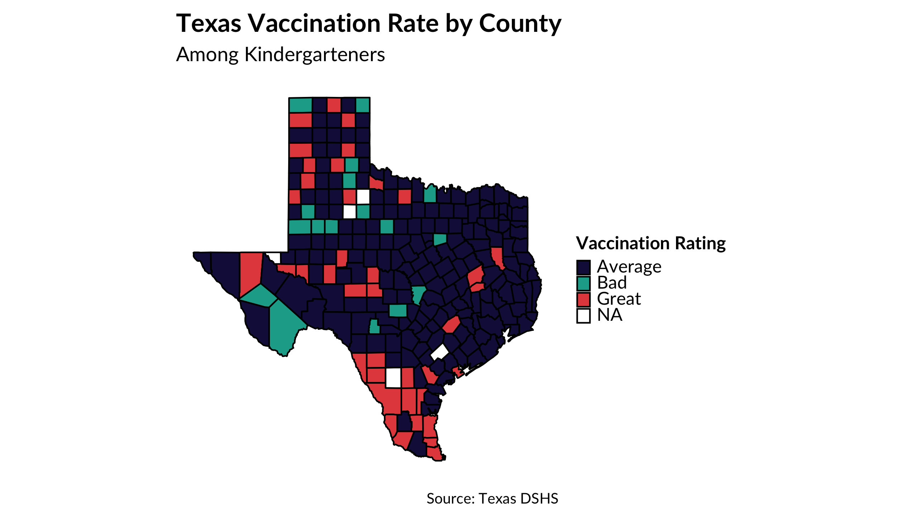
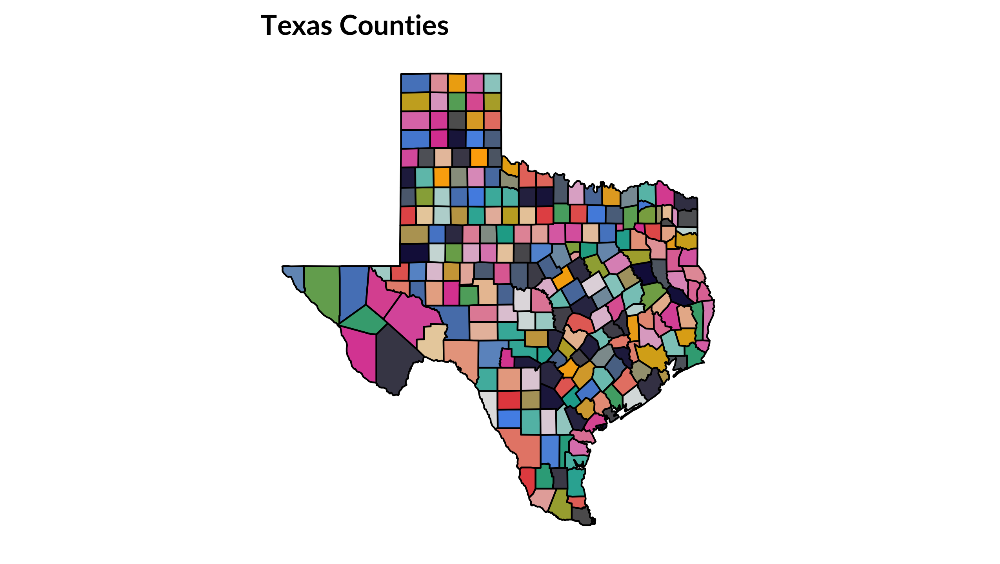
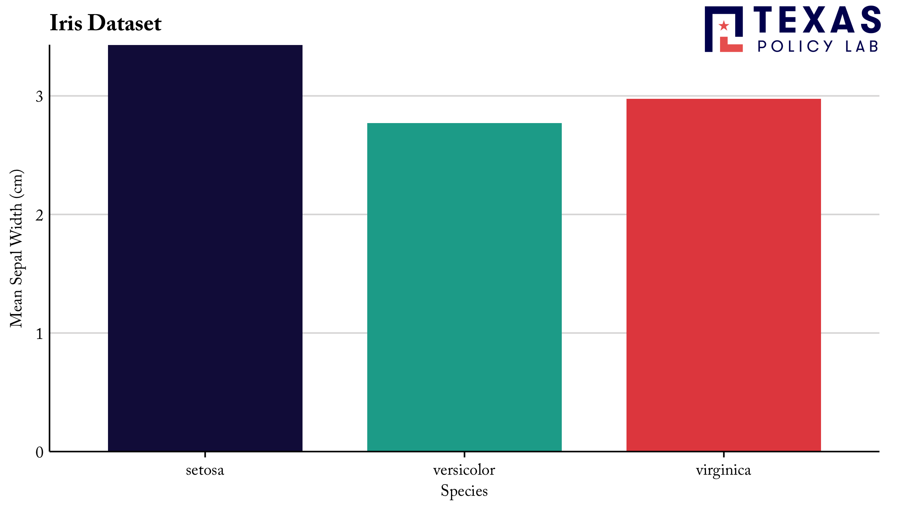
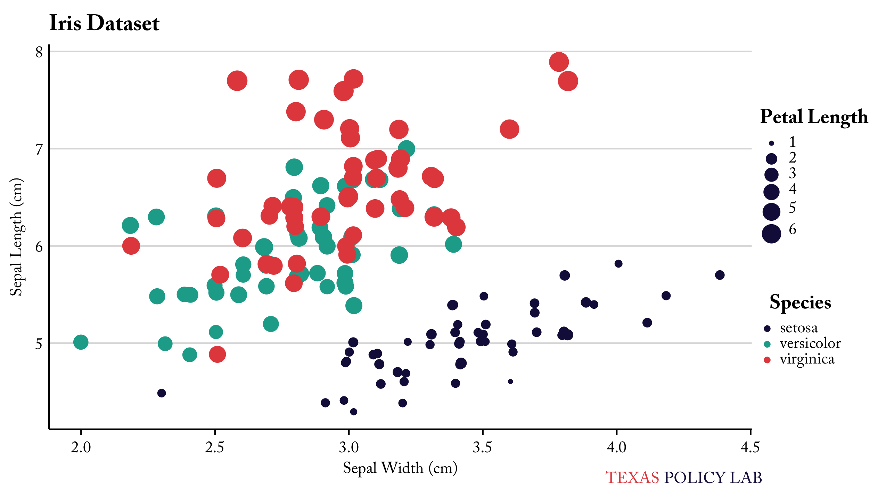
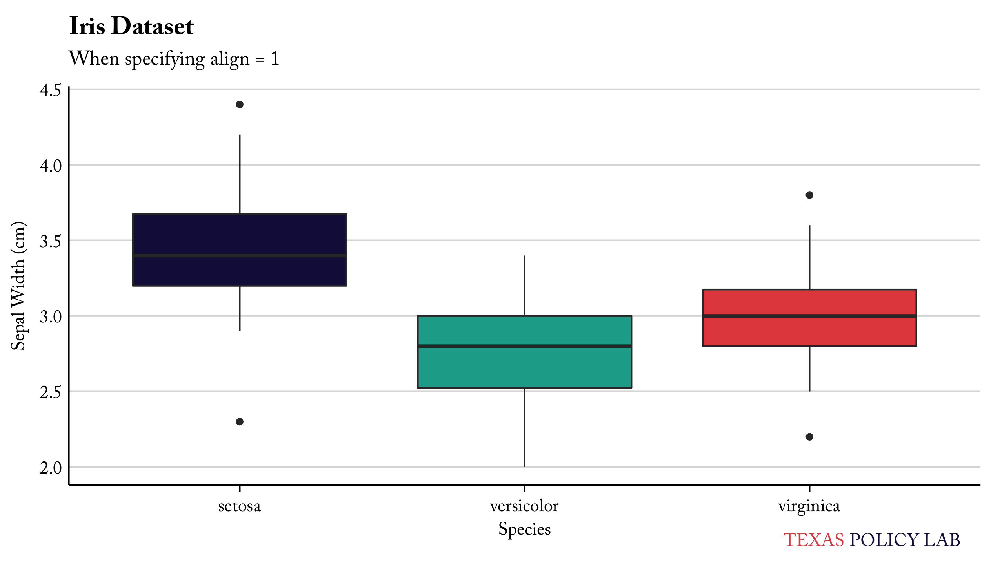

<!-- README.md is generated from README.Rmd. Please edit that file -->
TPL Theme
=========

Installation
------------

``` r
if (!require('devtools')) install.packages('devtools')
config <- utilsR::read_yaml("./config.yaml")
library(ggplot2)
#library(tpltheme)
devtools::load_all()
```

Plotting
--------

### Overview

This package creates a standardized formats for plots to be used in reports created by the Texas Policy Lab. It primarily relies on `set_tpl_theme`, which allows the user to specify whether the plot theme should align with a standard plot (`style = "print"`), or one specially created for plotting geographical data (`style = "Texas"`).

### Fonts

The user is able to specify whether they want to use *Lato* or *Adobe Caslon Pro* in their figures.

To ensure that these fonts are installed and registered, use `tpltheme::font_test()`. If fonts are not properly installed, install both fonts online and then run `tpltheme::font_install()`.

Once the fonts are installed, the user may specify their desired font within the `set_tpl_theme` function (`font = "adobe"`).

### Usage

Load `library(tpltheme)` **after** `library(ggplot2)` and/or `library(tidyverse)`.

A plot in TPL style may take the following forms:

``` r
set_tpl_theme(style = "print", font = "adobe")

ggplot(iris, aes(x=Species, y=Sepal.Width, fill=Species)) +
    geom_bar(stat="summary", fun.y="mean", show.legend = FALSE) +
    labs(x="Species", y="Mean Sepal Width (cm)", fill="Species", title="Iris Dataset")
```


``` r
ggplot(iris, aes(x=Species, y=Sepal.Width, fill=Species)) +
    geom_boxplot(show.legend = FALSE) +
    labs(x="Species", y="Sepal Width (cm)", fill="Species", title="Iris Dataset")
```



``` r
ggplot(iris, aes(x=Sepal.Width)) +
      geom_histogram(bins = 20) +
      labs(x="Sepal Width (cm)", y="Count", title="Iris Dataset")
```



``` r
ggplot(iris, aes(x=jitter(Sepal.Width), y=jitter(Sepal.Length), col=Species, size = Petal.Length)) +
    geom_point() +
    labs(x="Sepal Width (cm)", y="Sepal Length (cm)", col="Species", size = "Petal Length", title="Iris Dataset")
```



By specifying `style = "Texas"` within `set_tpl_theme`, the user may also create Texas-specific plots.

``` r
tx_vac <- readr::read_csv("https://raw.githubusercontent.com/connorrothschild/tpltheme/master/tx_vac_example.csv")
set_tpl_theme(style = "Texas")
ggplot2::ggplot(data = tx_vac, mapping = ggplot2::aes(x = long, y = lat, group = group, fill = avgvac*100)) +
  ggplot2::coord_fixed(1.3) +
  scale_fill_continuous(limits = c(78.3,100)) +
  ggplot2::geom_polygon(color = "black") +
  labs(title = "Texas Vaccination Rate by County",
       subtitle = "Among Kindergarteners",
       fill = "Percent\nVaccinated",
       caption = "Source: Texas DSHS")
```



And it also works for categorical variables:

``` r
tx_vac %>% 
  dplyr::mutate(cat = factor(dplyr::case_when(avgvac*100 > 99 ~ "Great",
                         avgvac*100 > 90 ~ "Average",
                         avgvac*100 < 90 ~ "Bad"))) %>% 
  ggplot2::ggplot(mapping = ggplot2::aes(x = long, y = lat, group = group, fill = cat)) +
  ggplot2::coord_fixed(1.3) +
  ggplot2::geom_polygon(color = "black") +
  labs(title = "Texas Vaccination Rate by County",
       subtitle = "Among Kindergarteners",
       fill = "Vaccination Rating",
       caption = "Source: Texas DSHS")
```



If the number of colors exceeds the number of colors in the TPL palette (9), the function `tpl_color_pal()` will drop the TPL color palette and return the greatest number of unique colors possible within the RColorBrewer's "Paired" palette (for more information on the use of RColorBrewer palettes, see [this chapter](https://bookdown.org/rdpeng/exdata/plotting-and-color-in-r.html#using-the-rcolorbrewer-palettes)).

``` r
tx_vac %>% 
  ggplot2::ggplot(mapping = ggplot2::aes(x = long, y = lat, group = group, fill = subregion)) +
  ggplot2::coord_fixed(1.3) +
  ggplot2::geom_polygon(color = "black", show.legend = FALSE) +
  labs(title = "Texas Counties")
```



``` r
# default to print afterwards
set_tpl_theme(style = "print")
```

### TPL Logo

The user also has the option to include the TPL logo in single plots. This may be preferred for those reports being made especially public, or to serve as a pseudo-watermark in proprietary plots.

To include the TPL logo, use the function `add_tpl_logo()` on an existing plot object:

``` r
library(grid)
library(gridExtra)
plot <- ggplot(iris, aes(x=jitter(Sepal.Width), y=jitter(Sepal.Length), col=Species, size = Petal.Length)) +
    geom_point() +
    labs(x="Sepal Width (cm)", y="Sepal Length (cm)", col="Species", size = "Petal Length", title="Iris Dataset")
    
add_tpl_logo(plot)
```



The user may also need to specify `align`, which moves the plot horizontally across the bottom of the page. This will be necessary if legends are removed or if the plot object is of unique dimensions.

``` r
plot <- ggplot(iris, aes(x=Species, y=Sepal.Width, fill=Species)) +
    geom_boxplot(show.legend = FALSE) +
    labs(x="Species", y="Sepal Width (cm)", fill="Species", title="Iris Dataset", subtitle="Without fixing logo alignment")
    
add_tpl_logo(plot, align = 0)  
```



``` r
plot <- ggplot(iris, aes(x=Species, y=Sepal.Width, fill=Species)) +
    geom_boxplot(show.legend = FALSE) +
    labs(x="Species", y="Sepal Width (cm)", fill="Species", title="Iris Dataset", subtitle ="When specifying align = 1.5")
    
add_tpl_logo(plot, align = 1.5)    
```


The process of specifying `align` is mostly guess-and-checking. Usually, the alignment will fall somewhere in the range of ~1 (rightward shift of one unit) and -1 (leftward shift of one unit). The argument allows for decimals for greater fine-tuned specification. It's default is 0.

### Drop Axes

In the event that the user wishes to drop an axis, they may do so with `drop_axis()`. The function may drop any combination of axes depending on the user's input (`drop = "x"`, `drop = "y"`, `drop = "both"`, `drop = "neither"`).

Unlike `add_tpl_logo()`, `drop_axis()` should be *added* to an existing plot object:

``` r
ggplot(iris, aes(x=jitter(Sepal.Width), y=jitter(Sepal.Length), col=Species, size = Petal.Length)) +
    geom_point() +
    labs(x="Sepal Width (cm)", y="Sepal Length (cm)", col="Species", size = "Petal Length", title="Iris Dataset") +
    drop_axis(axis = "y")
```


#### Additional Functions

-   `undo_tpl_theme`: Removes all TPL-specific theme settings and restores to ggplot defaults.
-   `tpl_plot_test`: Four base plots which allow the user to quickly see what a TPL-themed figure may look like. The user may specify the plot type (scatterplot, boxplot, barplot, histogram), the plot font (adobe, lato), and whether to include the TPL logo (include.logo = T).
-   `view_palette`: Plots base color palettes included in `tplthemes`. All TPL color palettes are led by the notation `palette_tpl_*` and therefore can be easily autocompleted within RStudio.

Reporting
---------

-   `read_word`: Reads word into Rmarkdown, such that word documents can be edited and read into the main Rmarkdown file for creating reports.
-   `read_word_table`: Reads a table from word into Rmarkdown, such that tables in word can be edited and then imported into Rmarkdown.
